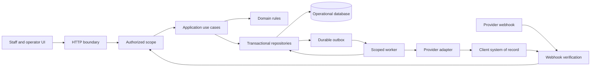

# Atrium application architecture

Status: current-state assessment and implementation direction, September 9, 2026. This document is a development contract for evolving Atrium into an operable SaaS product. A target described below is **not implemented** unless the current-state section identifies its code. Passing local tests does not establish commercial readiness.

Keep Atrium as one modular application initially. Preserve the tested leasing, knowledge, scheduling and booking rules while separating request handling, authorization, application workflows, storage and external connectors. Ordinary customer onboarding should eventually create validated records and configuration versions, without source edits or a separate deployment per building.

This file contains technical architecture only. Customer agreements, the detailed scope of work, business plans, pricing, credentials and private rollout evidence belong in approved private storage, outside the repository and public site assets. The private scope remains the source for contractual acceptance; this document does not reduce that scope.

## 1. Current code and its actual guarantees

| Area | Implemented boundary | Current limitation |
| --- | --- | --- |
| Runtime and delivery | Node 22, strict TypeScript, Vercel-style handlers in `api/`; `scripts/build-api.mjs` creates API bundles; `scripts/build-site.mjs` and `scripts/build-ops.mjs` generate artifacts. `scripts/lib/database-migrations.mjs` applies ordered SQL migrations with a transaction lock and checksum history. | The migration runner is exercised against temporary local databases. No production database, infrastructure definition, staged rollout controller or production backup/restore automation has been activated by this slice. Build success does not prove what is deployed. |
| Staff experience | `ops/src/` contains the authored HTML, CSS and browser JavaScript. The protected page is generated into `ops/dashboard.page.json` and served by `api/dashboard.ts`. | Feature code and API fetching remain concentrated in large browser modules. The console is a staff workspace, not separate role-authorized owner, vendor and platform-admin products. |
| Identity | Live handlers still use `src/ops/accounts.ts` and `src/ops/session.ts`: environment-configured accounts, scrypt hashes and tenant-bound sessions. The separate `src/auth/` foundation implements database identity/session contracts, current organization/property authorization, roles, explicit property grants and channel capabilities; `src/database/authorization.ts` supplies its PostgreSQL repository. | The new identity path is not selected by the portal or APIs. Existing users still have one environment-configured tenant and staff powers there. Credential/account migration, membership administration and portal integration remain open; MFA/SSO is not implemented. |
| Tenant and property scope | Existing handlers use `src/tenancy/context.ts`; named tenants have separate Redis namespaces and hosted requests require explicit tenant context. New `src/auth/` scopes have runtime issuance checks; `src/properties/context.ts` binds a validated snapshot separately. `src/database/scope.ts` checks current DB permission before and after scoped work. | New scopes and PostgreSQL row policies are tested foundations, not the current HTTP boundary. Local legacy fallback remains in the old adapter. Scope rechecks do not cancel work already committed or guarantee instantaneous revocation during a statement. |
| Property data | Live code uses bundled `data/property.json`, `inventory.json`, `floorplans.json` and `knowledge.json`. The new `src/properties/` snapshot validator checks ownership, IDs, timezone, jurisdiction, inventory and knowledge metadata while preserving source timestamps. `src/database/properties.ts` reads the current published pointer and content together. | Every current portal workspace still uses the bundled property template. The new repository has no bundled fallback but is not wired into handlers. Property selection/onboarding, runtime cache conversion and validated existing-data migration remain open. Re-reading configuration is not a PMS refresh. |
| Domain rules | `src/leasing/`, `inventory/`, `knowledge/`, `escalation/` and `conversation/` contain qualification, matching, answer guards and escalation logic. Branded IDs exist in `src/domain/ids.ts`. | Branded IDs are compile-time helpers; they do not validate ownership or persistence. Several workflows receive property context assembled directly in the HTTP handler. |
| Booking | `CalendarPort` separates booking orchestration from the calendar adapter. `bookTour` verifies read-back. The stored calendar atomically checks capacity, overlap, apartment policy, settings and per-interaction emergency holds, and preserves actual reservation intervals. | The calendar is Atrium's standalone schedule, not a connected PMS/calendar. `recordIntent` constructs an in-memory intent; there is no durable action-intent transaction before an arbitrary external write. A safety hold prevents later booking commits; it does not cancel a booking committed earlier. |
| Operational storage | Current runtime factories select memory locally or configured Redis in hosted environments, with compare-and-set updates and no silent hosted-memory fallback. New `src/database/operations.ts` provides property-scoped PostgreSQL document/calendar adapters: locks preserve mutation semantics and each write appends actor-attributed audit in the same transaction. `db/schema.sql` supplies ownership constraints, forced row policies and separate roles. | The PostgreSQL adapters are not selected by runtime factories or handlers. Transitional JSON rows still contain whole profiles/calendars; they are not normalized portfolio queries. No transaction yet spans call, lead, action intent and outbox job. Existing public health reports the old operational store. |
| Voice integration | `api/vapi.ts` validates webhook credentials, resolves bound assistant ownership, runs tools and merges call state. `src/vapi/` generates and synchronizes assistant configuration with read-back. Call history is filtered to allowed assistants. `src/leads/inbox.ts` records a finished-call receipt before projection, supports explicit replay and compacts completed receipts; failed projection returns retryable HTTP 503 and retains working call state. | The handler also owns orchestration, property loading and diagnostics. The finished-call inbox is a bounded first step, not a general event inbox/action outbox. No scheduled recovery worker, job leasing, general connector registry or provider-event reconciliation exists yet. Redis receipt/projection writes are separate operations with idempotent recovery, not a multi-record transaction. |
| History and work queues | Call/lead/follow-up documents persist when Redis is configured. Domain event types exist in `src/record/store.ts`; Vapi history is fetched separately. The new PostgreSQL operational adapters append scoped mutation audit, with application updates/deletes to audit denied. | Dashboard decision events remain process-local. The new audit covers adapter mutations, not every workflow, privileged read or external effect, and is not independently tamper-evident. `RecordStore` still has only a memory implementation. Follow-ups are not executable; no general outbox, worker or notification delivery is implemented. |
| Email and other channels | Email rendering/transport abstractions and simulations exist. | Email is not connected to the live booking workflow. Outbound SMS/calls, Apple Messages for Business, resident identity, maintenance/vendor/amenity lifecycle execution and billing are not delivered by the current leasing demo. |
| Runtime diagnostics | Vapi responses have request IDs; tool logs include tenant, request, full call/tool IDs, duration and error codes without caller words. PostgreSQL mutation audit records request/actor/scope and a digest of document keys. | Existing HTTP logging has not been converted to the new property scope. Centralized traces, complete workflow audit, operational metrics, alert routing and an operator recovery console remain open. |
| Verification | `npm run check` covers types, data validation and Node tests. `npm run test:database` exercises native temporary PostgreSQL databases, actual restricted roles, ownership, publication, authorization/revocation, concurrency, atomic audit and migrations. The CI workflow includes this database gate before build. `test/database/migrations.test.mjs` restores a synthetic snapshot into a fresh test database and checks exact records and rollback on invalid ownership. | Synthetic local restore is not production backup/restore, point-in-time recovery or a customer-data migration. These checks do not prove deployed database readiness, real provider behavior, voice latency, production load, MFA or complete contractual acceptance. |

`TENANCY.md` describes current environment-account isolation and tour settings. `db/README.md` documents the new SQL roles and constraints; [ADR 0001](docs/adr/0001-operational-postgres.md) records the engine decision and deployment gates. `QUALITY_REVIEW.md` records specific past verification runs and their limitations; its dated counts are historical evidence, not a live certification.

The PostgreSQL foundation has **not** replaced the portal/API account or storage paths. Adding
database connection settings alone does not select the new adapters. No remote database or
hosting project was connected for this work. Keep this distinction explicit in deployment
and customer-readiness claims until the full request-to-repository integration is verified.

The emergency admission hold and call projection are separate writes. Both must succeed
before the handler acknowledges emergency persistence; failures return HTTP 503 with safety
guidance in the response body for retry. A saved calendar hold remains effective when the
call projection fails, and a stronger known emergency takes precedence across both records.
The provider's actual handling of these error responses still requires channel testing.
No notification, responder dispatch or maintenance SLA is implied. The current calendar
document retains minimal holds indefinitely; lifecycle-based retention and transactional
incident/action storage must replace this before portfolio-scale deployment.

The local simulator creates a dedicated worker with synthetic tenant credentials and memory
stores per scenario. It denies application network transports in that worker; only the parent
model adapter may contact its fixed model endpoint. This is not an OS security sandbox and
does not establish Vapi audio behavior. A past scheduled tour remains scheduled until an
attendance workflow supplies evidence; elapsed time is not a conversion event.

## 2. Target boundaries



This diagram is the target, including components that do not exist yet. Keep the dependency direction explicit:

- **Transport:** authenticate, parse bounded input, resolve scope, invoke one use case and map the outcome to an HTTP or provider response. No direct rent, capacity, knowledge or authority decisions in a route.
- **Application use cases:** coordinate authorization, repositories, domain decisions and connector commands. Define transaction and retry boundaries here.
- **Domain:** deterministic rules with explicit input, clock and configuration version. Domain functions do not read environment variables, HTTP cookies, process-local tenant context or provider APIs.
- **Repositories:** scope every query and mutation, own serialization and database constraints, and expose domain operations rather than arbitrary unscoped JSON keys.
- **Connectors:** normalize external systems into versioned capabilities. Own provider authentication, timeouts, error classification, pagination and external identity mapping. They do not decide a user's permission.
- **Workers:** claim persisted work and execute application use cases under a recorded service principal. A worker is another application entry point, not an exception to authorization.
- **UI:** display server-authorized data and truthful workflow states. Browser filtering and hidden buttons are usability features, never the access-control boundary.

A practical extraction layout is `src/auth/`, `src/application/`, existing domain folders, `src/repositories/`, `src/connectors/` and `src/jobs/`. Create a module when a real workflow uses it. Keep API compatibility while moving behavior out of large handlers. Independent services become justified only by measured scaling, failure-isolation or ownership needs.

## 3. Organization, property and membership model

The target hierarchy is **client organization → property**, with portfolios grouping properties within the same organization. Atrium platform administrators are a separate principal class with explicit support capabilities. They are not ordinary client users with an unrestricted tenant selector.

| Record | Scope and invariant |
| --- | --- |
| Organization | Stable client identity, lifecycle state and customer-level policy. Never infer it from a browser label or email domain. |
| Property | Belongs to exactly one organization; holds location, timezone and references to published configuration. Portfolio membership cannot cross organizations. |
| User identity | Authenticated staff subject. May have multiple organization memberships, which confer no rights until checked for the chosen operation. |
| Membership and grant | Connects user to organization, role and optional property set; records status, permission version and revocation. Organization-wide access must be an explicit grant. |
| Platform/service principal | Has a purpose, allowed capabilities and scoped access. Support access is time-limited and auditable; background jobs record their initiating actor separately. |
| Person and contact identity | Person history is scoped to one client organization and may span its properties. Phone/email is a contact claim, not resident identity proof. No automatic cross-client person matching. |
| Interaction and workflow | Carries organization, property, person when known, channel, source identity and workflow ID. Unknown callers remain distinct until verified linkage is established. |
| Channel/connector binding | Server-owned binding from provider identity to organization/property and permitted capabilities. Provider IDs from model-generated arguments never choose scope. |

The server must resolve a request into an immutable **authorized scope** after identity verification and current membership/policy evaluation. The new `src/auth/model.ts` defines `AuthorizedScope`; `src/auth/authorization.ts` issues and checks its runtime provenance. The PostgreSQL adapters receive this scope explicitly, but current HTTP handlers have not adopted it. A later normalized booking repository can use the existing scope:

```ts
import type { AuthorizedScope } from './src/auth/index.ts'

// Target application contract, not an existing normalized repository.
interface BookingRepository {
  reserve(scope: AuthorizedScope, command: ReserveTour): Promise<BookingOutcome>
  findByIdempotencyKey(scope: AuthorizedScope, key: string): Promise<Booking | null>
}
```

Only the authorization module may issue this scope. Compile-time types alone do not make it trusted. The repository still binds organization/property IDs into every query and verifies returned ownership. Preserve the current hosted-runtime rejection of missing tenant scope, then extend it to explicit property authorization. Retire the remaining local `legacy` fallback into an explicit fixture/migration adapter; it must not become the default for new paths.

Switching properties means requesting and receiving a newly authorized scope, not changing a client-supplied tenant field. Workers retain original attribution but recheck current property status, connector authority, consent and approval validity before executing delayed work. Role revocation must affect pending work, exports and live sessions.

## 4. Durable data and transaction design

PostgreSQL is the selected relational engine, with the `pg` driver, private `atrium` schema and separate application/authenticator/maintenance roles; see [ADR 0001](docs/adr/0001-operational-postgres.md). `src/database/` and the initial migration implement the first repository slice. Native local tests use the pinned PostgreSQL 17.10 fixture package. This does not select a production host or establish its currently appropriate patch version. Provider/project, cost, residency, backup/recovery and operating ownership reviews remain open; no remote Supabase or other hosted database is connected by this decision.

The client PMS remains authoritative for the records it owns. Atrium stores operational intent, verified projections, workflow history and reconciliation evidence; it must not silently become a competing source of truth for leases, balances or work orders.

The initial schema contains organizations, properties, users/credentials, memberships, property grants, configuration versions, channel bindings, transitional operational documents/calendars and mutation audit. People/contact claims, normalized interactions, booking intents/reservations, webhook receipts, workflow actions and outbox jobs still need dedicated repositories and migrations. Add resident, lease, vendor, maintenance, amenity, recommendation/intervention and outcome records with their workflows, retaining the same identity and audit envelope.

Enforce these invariants in storage as well as services:

- Non-null organization ownership on every tenant-owned row; property ownership on property operations. Use composite foreign keys such as `(organization_id, property_id)` so a record cannot reference another organization's property.
- Uniqueness of `(organization_id, connector_id, object_type, external_id)` for external mappings. Provider call IDs, apartment labels and email addresses are not globally unique application identities.
- A unique idempotency key per workflow scope plus a canonical payload hash. Reusing the key with changed apartment, time or operation must conflict, not return an unrelated success.
- Atomic publication of a complete configuration version. Each decision/action records the rules and source versions it used; later edits do not rewrite past decisions.
- A booking transaction validates current rules, checks peak resource occupancy, reserves the interval and persists the action/audit/outbox records together. A unique start timestamp alone cannot enforce capacity greater than one or overlapping durations. Use a property/resource scheduling lock or equivalent serializable transaction, with a documented lock order and concurrency tests.
- Persist actual tour and occupied intervals separately, using half-open intervals `[start, end)`. Store instants in UTC and property timezone as configuration; keep business dates as dates. Existing reservations never change duration because current settings change.
- Database enforcement of row scope where supported, under the real application role. Connection-pool scope must be transaction-local and cleared between requests. Administrative database access must not be the application default.
- Indexed, bounded queries and scope-bound pagination cursors. Avoid full tenant scans or loading every call/profile to render a page. Cursor validation must not allow a cursor from another organization to reveal rows.
- Schema validation and explicit serialization at boundaries. JSON payloads may hold provider extensions, but ownership, workflow state, timestamps, keys and relational references must be typed columns with constraints.

`scripts/lib/database-migrations.mjs` now supplies ordered migrations, a private history table, checksums and a transaction advisory lock. `supabase/migrations/` holds the generated initial migration; the directory format is compatible with Supabase tooling and does not imply a hosted project. Tests exercise first application, idempotent rerun and refusal of checksum/history drift. Upgrade/backfill/cutover from existing operational data remains unimplemented. Use expand → backfill → verify → cut over → contract changes so old and new application versions can coexist during rollout. Backfills must be scoped, restartable and report counts and exceptions.

Migrating current Redis data needs an explicit mapping of legacy/named tenant IDs to organization and property IDs, source backup, dry run, duplicate/ownership reconciliation and a reversible cutover. Do not infer that all legacy data belongs to the new Larkin account. Compare counts, booking intervals, contact associations and ownership before enabling writes. Avoid uncoordinated dual writes; if parallel reads are used to verify migration, define which store is authoritative and how divergence is resolved.

## 5. Reliable integration execution

Extend the current finished-call receipt into a **durable inbox and outbox** before enabling unattended external actions. `src/leads/inbox.ts` already persists pending/complete call receipts and exposes `replayFinishedCall`; it relies on redelivery or explicit replay and does not schedule a worker. Preserve that recovery behavior while moving receipt, action and audit ownership into transactional repositories.

1. Authenticate and validate an incoming provider event, resolve its owned channel binding and store a receipt with a unique provider event key. Retain only the permitted payload and a payload digest. Replays must return the prior accepted result without repeating side effects.
2. In one database transaction, record the workflow/action intent, required authority or approval, current configuration/source version, audit event and any outbox work. Commit before attempting an external write. The existing in-memory `recordIntent` is insufficient for this guarantee.
3. A worker claims work with a lease and attempt count. Recheck current permissions, consent, property activation and connector capability. Network requests happen outside database transactions and Redis compare-and-set callbacks.
4. Send a stable provider idempotency key when supported. After an ambiguous timeout, look up/reconcile the original action before attempting another create. Document the safe manual path for providers that cannot support reliable deduplication or read-back.
5. Read back and compare the persisted external result. Move from `pending`/`executing` to `verified` only after this succeeds. The UI and voice response must distinguish pending, awaiting approval, retrying, blocked, verified and terminal failure.
6. Persist retry scheduling with bounded exponential backoff and jitter, connector circuit breakers, per-organization/provider concurrency budgets and a visible dead-letter/reconciliation queue. Preserve the original operation key during replay.
7. Run scheduled reconciliation and harmless synthetic checks through the same owned connector binding. Surface divergence, lost authorization, stale inventory and expired credentials with an operator and a next action.

Expected delivery is **at least once with idempotent processing and reconciliation**, not a claim of exactly-once external execution. Webhook receipt, workflow transition, outgoing message and verified completion are different events.

A connector capability record must identify available reads/writes, source-of-truth ownership, mapping version, rate limits, freshness policy, retry/read-back behavior, authorization method, health check, owner and manual fallback. Prefer authorized APIs and structured exchange; browser automation requires explicit client authorization and the same reliability controls. Do not make live connector installation or provider selection implicit in ordinary property onboarding.

## 6. Audit, observability and production debugging

Treat the audit ledger, operational logs and customer-visible history as separate products with different access and retention rules.

- **Audit:** append an actor-attributed event for privileged access, membership changes, configuration publication, approvals, external actions, exports and deletion. Include organization/property/workflow, trigger, decision/rule version, permitted input references, approver, before/after references and external result. Deny application updates/deletes to the ledger. Establish tamper evidence through independently retained checkpoints or equivalent protected storage; an editable table called `audit` is not tamper-evident.
- **Logs and traces:** carry request/trace ID, organization/property IDs, workflow/action/attempt ID, connector and deployed revision. Use structured error codes and redacted summaries. Do not log credentials, raw transcripts, caller numbers or full external payloads by default. Restricted evidence must be fetched through audited, role-scoped access.
- **Metrics:** track request and webhook latency, rejected signatures, deduplication, queue depth/oldest age, retries/dead letters, connector error/read-back mismatch rate, source freshness, booking contention, worker saturation and configuration version. Measure cost and usage by organization/connector without using unbounded customer labels in metrics.
- **Health:** separate process liveness, dependency readiness and property/connector workflow health. The public `api/health.ts` probe uses an explicit legacy infrastructure scope and returns no customer records; it is not proof of a successful booking, complete tenant configuration or voice performance. Keep detailed diagnostics authenticated.
- **Operator workflow:** locate an incident from a trace or action ID, inspect the scoped timeline and decision versions, identify whether a side effect happened, apply a permitted correction and replay safely. Support access and replay must themselves be audited.

Publish service objectives and alert routing only after owners approve measurable thresholds. Add runbooks for provider outage, database unavailability, webhook backlog, booking divergence, failed escalation, credential expiry, unauthorized access and deployment regression. Each runbook needs a detection signal, owner, containment steps, recovery verification and evidence location.

## 7. Recovery, release and acceptance

Maintain separate development, staging and production resources and credentials. The fixture server intentionally ignores live Redis/Vapi credentials and resets operational data; keep that behavior. A demo seed belongs only to its designated demo organization/property. Build artifacts and test fixtures must never include production credentials or resident data.

The new test fixture starts a private temporary native PostgreSQL instance and removes it
after testing. Its synthetic snapshot/restore test verifies schema-level round-trip and
ownership rollback, not a persistent development preview, production backup service or
restore runbook. A durable local preview and hash-preserving Larkin account import still
need an explicit integration path separate from disposable fixture mode.

Before a production activation, establish approved recovery-point and recovery-time objectives, encrypted backups, restoration credentials and a restore drill into an isolated environment. Verify schema version, record counts, ownership constraints, booking intervals, required audit history and connector mappings. A successful backup job is not a restore demonstration. A rollback must account for both application and schema compatibility, and must not replay external actions blindly.

Retention requires scheduled, auditable jobs for raw audio, transcripts, attachments, exports and expired sessions/receipts, according to approved policy and legal holds. Deletion must cover replicas, derived stores and provider-held copies where supported, while preserving permitted audit evidence. Tenant offboarding must revoke users, service credentials, sender bindings and queued work before export/deletion completion is claimed.

Keep the current fast gate:

```sh
npm ci
npm run check
npm run test:database
npm run build
```

Add release gates in stages, with evidence tied to the exact commit, configuration and schema versions:

1. Extend the implemented native database/repository, migration, direct row-scope, concurrency and multi-property authorization tests through the actual HTTP/portal paths and future normalized workflow repositories.
2. Handler-to-worker-to-provider contract tests, including duplicate/out-of-order events, uncertain writes, expired credentials, authority revocation, stopped workers, dead-letter replay and reconciliation.
3. Browser smoke tests of login, property switching, role restrictions, configuration changes, booking, failure visibility and operator recovery. Test compiled artifacts as well as source mode.
4. Approved staging provider scenarios and post-deployment synthetic checks; voice tests must measure the actual channel, interruptions and latency rather than treating text simulations as equivalent.
5. Dependency/secret scanning, static security checks, SBOM generation, branch protection/review, targeted security assessment and documented handling of high-severity findings.
6. Backup restore and rollback evidence, operational alerts and incident ownership before activating a property.

Critical invariant failures block promotion. Feature flags and staged property activation must be server-owned configuration, defaulting new external capabilities to inactive. No UI copy may claim a message, booking, dispatch or deployment succeeded solely because a request was attempted.

## 8. Implementation sequence and first foundation milestone

### Milestone 1 — explicit property scope and configurable property records

**In progress; not complete.** The domain/repository foundation now exists and has native PostgreSQL coverage. The portal and APIs still use legacy environment accounts, tenant namespaces and bundled property data. Completion requires a vertical slice from authenticated HTTP request through authorization, property configuration, repository and existing leasing/calendar rules, supporting **two organizations with two distinct properties each** without changing application source for the fourth property.

Implemented foundation:

- `src/auth/`: validated organization/property/membership/grant/channel records, user sessions, explicit access policy and runtime-issued scope. `src/database/authorization.ts` re-reads the corresponding records through the authenticator role.
- `src/properties/` and `src/database/properties.ts`: validated published property snapshots, explicit timezone/jurisdiction and ownership checks, preserved inventory source timestamps, immutable raw configuration and isolated request context. Missing database configuration never falls back to the bundle.
- `db/schema.sql`, `supabase/migrations/` and `scripts/lib/database-migrations.mjs`: constrained PostgreSQL schema, forced row policies, separate roles and initial migration/checksum history. Engine selection is documented in ADR 0001.
- `src/database/operations.ts`: transitional property-scoped JSON document/calendar adapters, concurrency locks, current permission rechecks and atomic mutation audit. The scoped calendar wrapper rejects mismatched domain property arguments.
- `test/database/`: actual-role isolation, repeated IDs across organizations/properties, revoked authority and mid-request races, property publication, concurrent writes/bookings, audit rollback, migration drift and synthetic fresh-database snapshot restore.

Remaining before milestone completion:

- Preserve the existing Larkin credential through a validated one-time account/organization/property import; migrate operational data with explicit source-to-target mapping, backup, dry-run reconciliation and rollback.
- Wire every protected API, verified provider binding, history cache, receipt replay and calendar operation into the same authorized property snapshot. Remove global bundled facts from DB paths, including nested defaults. Complete property configuration for showing rules, escalation contacts and channel ownership; keep secrets separately protected.
- Add authorized property discovery and safe per-tab property selection to the actual portal. Return and check organization/property/configuration identity on reads and writes; demonstrate role restrictions and stale-page refusal in browser tests.
- Move Vapi context assembly into an application boundary. Preserve emergency guidance and booking safety while replacing hard-coded property/jurisdiction/inventory choices.
- Select runtime adapters explicitly and implement a durable local preview separately from disposable fixtures. Prove login, data and settings survive restart without reseeding or password changes.
- Verify the complete HTTP-to-database path and migration/cutover on one isolated demo organization before broader activation. Production hosting, patch/support review and operational restore evidence remain separate release gates.

### Milestone 2 — durable workflow and operator recovery

Extend the existing finished-call receipt/replay path into the inbox/action/outbox transaction, durable audit, worker leases, read-back, reconciliation and recovery UI for one real connector-backed booking workflow. Prove recovery when the process dies before send, after provider success and before verification. Follow-up records become executable only after sender ownership, consent/authority, deduplication and delivery evidence are in place.

### Milestone 3 — repeatable customer operations

Add membership administration/MFA, property onboarding with validation and dry runs, connector capability/health screens, approved configuration publication, scoped exports, retention/offboarding and tested backup recovery. Measure actual workload, latency and cost before changing deployment topology.

### Milestone 4 — expand workflows on shared foundations

Implement the remaining resident, maintenance, vendor, amenity, approval and evidence-based intelligence workflows using the same principals, action state machine, connector contracts and audit envelope. Each module needs its complete operational lifecycle and failure recovery; creating a table or a new screen does not establish delivery.

## 9. Enforceable development rules

1. New protected use cases require explicit authorized scope. Missing organization/property context is an error; never fall back to a demo tenant or bundled property.
2. Every tenant-owned repository operation and job includes ownership constraints. Add negative cross-organization and cross-property tests for new reads, writes, lists, exports and caches.
3. Keep business rules in tested domain/application modules. HTTP handlers, prompts and browser code cannot independently invent booking or authority rules.
4. No network side effects inside retryable transactions or compare-and-set callbacks. Action intent, audit and durable work must commit together before external execution.
5. An idempotency key identifies one immutable operation. A changed payload conflicts; uncertain outcomes require read-back/reconciliation.
6. New storage fields require validation, a migration/version strategy and backward compatibility or an explicit cutover plan. No production edits through one-off scripts without scoped dry-run and recovery evidence.
7. Property facts, hours, timezone, source bindings and permissions are configuration. Customer onboarding must not add conditionals such as `if tenant === ...` to domain code.
8. Every external capability declares its owner, scope, health, timeout, retries, read-back, rate budget, freshness and fallback. An unavailable connector must produce visible pending/manual work.
9. Operational errors need stable codes and trace/action IDs; secrets and raw personal content stay out of routine logs and public artifacts.
10. Tests assert business invariants and failure behavior. A fixture response is not evidence that a production provider or database works. Record what was exercised and what remains unverified.
11. Generated dashboard/site/assistant files are derived artifacts; edit their authored inputs and rebuild. Separate mechanical extraction from behavioral changes when possible, preserving regression coverage.
12. Architecture changes need a short decision record: problem, chosen boundary, alternatives considered, migration, verification and rollback. New dependencies or services need a concrete capability and operating owner.

Use this document with the current code and private acceptance requirements. When a milestone lands, update its status with specific source paths, migrations and verification evidence rather than leaving a permanent design claim that the system already satisfies.
