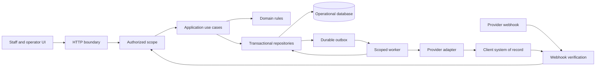

# Atrium application architecture

Status: current-state assessment and implementation direction, September 9, 2026. This document is a development contract for evolving Atrium into an operable SaaS product. A target described below is **not implemented** unless the current-state section identifies its code. Passing local tests does not establish commercial readiness.

Keep Atrium as one modular application initially. Preserve the tested leasing, knowledge, scheduling and booking rules while separating request handling, authorization, application workflows, storage and external connectors. Ordinary customer onboarding should eventually create validated records and configuration versions, without source edits or a separate deployment per building.

This file contains technical architecture only. Customer agreements, the detailed scope of work, business plans, pricing, credentials and private rollout evidence belong in approved private storage, outside the repository and public site assets. The private scope remains the source for contractual acceptance; this document does not reduce that scope.

## 1. Current code and its actual guarantees

| Area | Implemented boundary | Current limitation |
| --- | --- | --- |
| Runtime and delivery | Node 22, strict TypeScript, Vercel-style handlers in `api/`; `scripts/build-api.mjs` creates API bundles; `scripts/build-site.mjs` and `scripts/build-ops.mjs` generate artifacts. `scripts/lib/database-migrations.mjs` applies ordered SQL migrations with a transaction lock and checksum history. | The migration runner is exercised against temporary local databases. No production database, infrastructure definition, staged rollout controller or production backup/restore automation has been activated by this slice. Build success does not prove what is deployed. |
| Staff experience | `ops/src/` is the authored portal, generated into `ops/dashboard.page.json` and served by `api/dashboard.ts`. In PostgreSQL mode, `api/properties.ts` lists authorized properties; full-page selection fixes organization/property/configuration headers per document. API scope echoes are checked before results are displayed; viewer controls and revoked/stale-page states are handled. | Large browser modules remain. These controls supplement server authorization; the console is not the full owner, vendor or platform-admin product. |
| Identity | Explicit `ATRIUM_RUNTIME_MODE=postgres` selects `src/application/runtime.ts` and `src/auth/` for persisted user sessions, current organization/property authorization, roles, explicit property grants and channel capabilities. `src/database/authorization.ts` supplies the repository. Legacy environment accounts/session handling remain in the separately selected compatibility path. | Local Larkin credential import and protected HTTP/portal integration exist. Existing-member role/property administration is implemented with scoped directory and atomic receipts. Invitations, customer credential/data migration, enterprise SSO and production activation remain open. Session-bound WebAuthn passkeys, recovery and least-privilege SQL commands are implemented; physical-device and hosted acceptance remain separate. Deployment URLs/session secret are configured once, not per login. |
| Tenant and property scope | PostgreSQL handlers resolve runtime-issued `AuthorizedScope` and a validated published snapshot through `src/application/runtime.ts` and `src/database/request.ts`. `src/database/scope.ts` rechecks current DB permission and expected configuration before and after work. Provider routing identity is immutable, and fetched call history is revalidated before release. Legacy tenant namespaces remain separate. | Existing HTTP/portal boundaries are wired and tested. Future workers, exports and new workflows still need explicit authority and ownership checks. Rechecks do not cancel already committed work or promise instantaneous mid-statement revocation. |
| Property data | PostgreSQL runtime loads the current published property bundle through `src/properties/` and `src/database/properties.ts`, validates ownership/timezone/jurisdiction/inventory/knowledge, and preserves source timestamps. Required published tour settings reach calendar/Vapi; portal facts come from a bounded server projection. Explicit fictional catalogue provenance permits labelled sample quotes without refreshing source dates. | No bundled fallback exists in DB paths. Legacy mode uses bundled content; neither reading a configuration nor loading a fictional catalogue establishes PMS freshness. Guided onboarding, full operating protocols and real customer-data migration remain open. |
| Domain rules | `src/leasing/`, `inventory/`, `knowledge/`, `escalation/` and `conversation/` contain qualification, matching, answer guards and escalation logic. Branded IDs exist in `src/domain/ids.ts`. | Branded IDs are compile-time helpers; they do not validate ownership or persistence. Several workflows receive property context assembled directly in the HTTP handler. |
| Booking | `CalendarPort` separates booking orchestration from the calendar adapter. `bookTour` verifies read-back. The stored calendar atomically checks capacity, overlap, apartment policy, settings and per-interaction emergency holds, and preserves actual reservation intervals. | The calendar is Atrium's standalone schedule, not a connected PMS/calendar. Booking's `recordIntent` remains in memory and is not yet integrated with the new durable workflow repository. A safety hold prevents later booking commits; it does not cancel a booking committed earlier. |
| Operational storage | `src/store/documents.ts` and `src/calendar/store.ts` select the scoped PostgreSQL adapters from the request runtime when PostgreSQL mode is active. `src/database/operations.ts` preserves document/calendar mutation semantics with locks and atomic actor-attributed audit; schema constraints and forced row policies enforce ownership. Legacy memory/Redis selection remains explicit and hosted memory fallback is refused. | JSON rows still contain whole profiles/calendars and are not normalized portfolio queries. No transaction yet spans receipt, profile, action and outbox work. No production database activation or full operational recovery is established. |
| Voice integration | `api/vapi.ts` validates webhook credentials, resolves a verified channel binding into the current property runtime, runs tools and merges call state. History is filtered to allowed assistants and revalidated after fetch. `src/leads/inbox.ts` retains original finished-call scope/timezone before projection, supports replay and compacts completed receipts; failed projection returns retryable503. | The handler still owns substantial orchestration. Receipt/profile/follow-up writes remain separate operations in both JSON storage paths; replay is not a transactionally coupled action/outbox or scheduled worker. Property assistant publication remains disabled in DB mode, and local contract tests do not prove the saved live assistant/backend is synchronized. |
| History and work queues | Call/lead/follow-up documents persist in scoped PostgreSQL runtime or configured legacy Redis. Operational mutations append scoped audit atomically. `src/database/workflows.ts`, `src/workflows/` and `db/workflows.sql` add atomic receipt/action/outbox/events, fenced leases, scoped execution, read-back verification and audited replay. | The workflow foundation is exercised by isolated tests, including a loopback HTTP provider. Existing finished-call projection, booking and follow-ups are not integrated with it. The property recovery API/portal is implemented in PostgreSQL mode; no deployed runner, production connector registry or notification delivery is activated. Dashboard decision events and `RecordStore` remain process-local; audit is not independently tamper-evident. |
| Email and other channels | Email rendering/transport abstractions and simulations exist. | Email is not connected to the live booking workflow. Outbound SMS/calls, Apple Messages for Business, resident identity, maintenance/vendor/amenity lifecycle execution and billing are not delivered by the current leasing demo. |
| Runtime diagnostics | Vapi request/tool logs identify organization/property in PostgreSQL mode or tenant in legacy mode, with request/call/tool IDs, duration and error codes without caller words. Mutation audit includes request/actor/configuration scope and digested document keys. Public health distinguishes the selected runtime and exposes a non-secret voice-contract fingerprint. | Centralized traces, complete cross-workflow audit, operational metrics and alert routing remain open. A property Work queue provides scoped inspection and recovery. Healthy storage and a matching schema do not prove channel behavior. |
| Verification | `npm run check` covers types, data and Node tests. Native PostgreSQL tests exercise restricted roles, ownership, publication, revocation/races, concurrency, atomic audit and migrations, plus persisted login/property selection and scoped calendar/leads/Vapi HTTP paths. Workflow tests add duplicate receipts, leases/replay and actual loopback HTTP effects with lost responses, mismatched read-back and revocation holds. Portal/restart tests preserve scope, credentials, grants, records and settings. Synthetic snapshot restore tests verify exact records and ownership rollback. | Local synthetic/browser/HTTP proof is not production backup/restore, PITR, customer migration, real provider execution, audio latency, production load, physical passkey hardware or contractual acceptance. Build success alone does not prove deployment adoption. |

`TENANCY.md` describes current environment-account isolation and tour settings. `db/README.md` documents the new SQL roles and constraints; [ADR 0001](docs/adr/0001-operational-postgres.md) records the engine decision and deployment gates. `QUALITY_REVIEW.md` records specific past verification runs and their limitations; its dated counts are historical evidence, not a live certification.

The PostgreSQL path is wired through protected portal/API requests and selected only by explicit
`ATRIUM_RUNTIME_MODE=postgres` with valid deployment configuration. Connection settings alone
are rejected rather than silently selecting an adapter. Local persistent preview and isolated
HTTP/browser verification exercise this path; they do not establish a hosted database or
production cutover. Legacy deployments remain on their separately configured compatibility path.

The emergency admission hold and call projection are separate writes. Both must succeed
before the handler acknowledges emergency persistence; failures return HTTP 503 with safety
guidance in the response body for retry. A saved calendar hold remains effective when the
call projection fails, and a stronger known emergency takes precedence across both records.
The provider's actual handling of these error responses still requires channel testing.
No notification, responder dispatch or maintenance SLA is implied. The current calendar
document retains minimal holds indefinitely; lifecycle-based retention and transactional
incident/action storage must replace this before portfolio-scale deployment.

The local simulator creates a dedicated worker with synthetic tenant credentials and memory
stores per scenario. It denies application network transports in that worker; only the parent
model adapter may contact its fixed model endpoint. This is not an OS security sandbox and
does not establish Vapi audio behavior. A past scheduled tour remains scheduled until an
attendance workflow supplies evidence; elapsed time is not a conversion event.

## 2. Target boundaries



This diagram is the target, including components that do not exist yet. Keep the dependency direction explicit:

- **Transport:** authenticate, parse bounded input, resolve scope, invoke one use case and map the outcome to an HTTP or provider response. No direct rent, capacity, knowledge or authority decisions in a route.
- **Application use cases:** coordinate authorization, repositories, domain decisions and connector commands. Define transaction and retry boundaries here.
- **Domain:** deterministic rules with explicit input, clock and configuration version. Domain functions do not read environment variables, HTTP cookies, process-local tenant context or provider APIs.
- **Repositories:** scope every query and mutation, own serialization and database constraints, and expose domain operations rather than arbitrary unscoped JSON keys.
- **Connectors:** normalize external systems into versioned capabilities. Own provider authentication, timeouts, error classification, pagination and external identity mapping. They do not decide a user's permission.
- **Workers:** claim persisted work and execute application use cases under a recorded service principal. A worker is another application entry point, not an exception to authorization.
- **UI:** display server-authorized data and truthful workflow states. Browser filtering and hidden buttons are usability features, never the access-control boundary.

A practical extraction layout is `src/auth/`, `src/application/`, existing domain folders, `src/repositories/`, `src/connectors/` and `src/jobs/`. Create a module when a real workflow uses it. Keep API compatibility while moving behavior out of large handlers. Independent services become justified only by measured scaling, failure-isolation or ownership needs.

## 3. Organization, property and membership model

The target hierarchy is **client organization → property**, with portfolios grouping properties within the same organization. Atrium platform administrators are a separate principal class with explicit support capabilities. They are not ordinary client users with an unrestricted tenant selector.

| Record | Scope and invariant |
| --- | --- |
| Organization | Stable client identity, lifecycle state and customer-level policy. Never infer it from a browser label or email domain. |
| Property | Belongs to exactly one organization; holds location, timezone and references to published configuration. Portfolio membership cannot cross organizations. |
| User identity | Authenticated staff subject. May have multiple organization memberships, which confer no rights until checked for the chosen operation. |
| Membership and grant | Connects user to organization, role and optional property set; records status, permission version and revocation. Organization-wide access must be an explicit grant. |
| Platform/service principal | Has a purpose, allowed capabilities and scoped access. Support access is time-limited and auditable; background jobs record their initiating actor separately. |
| Person and contact identity | Person history is scoped to one client organization and may span its properties. Phone/email is a contact claim, not resident identity proof. No automatic cross-client person matching. |
| Interaction and workflow | Carries organization, property, person when known, channel, source identity and workflow ID. Unknown callers remain distinct until verified linkage is established. |
| Channel/connector binding | Server-owned binding from provider identity to organization/property and permitted capabilities. Provider IDs from model-generated arguments never choose scope. |

The server must resolve a request into an immutable **authorized scope** after identity verification and current membership/policy evaluation. The new `src/auth/model.ts` defines `AuthorizedScope`; `src/auth/authorization.ts` issues and checks its runtime provenance. The PostgreSQL adapters receive this scope explicitly through the current opt-in HTTP runtime. A later normalized booking repository can use the same scope:

```ts
import type { AuthorizedScope } from './src/auth/index.ts'

// Target application contract, not an existing normalized repository.
interface BookingRepository {
  reserve(scope: AuthorizedScope, command: ReserveTour): Promise<BookingOutcome>
  findByIdempotencyKey(scope: AuthorizedScope, key: string): Promise<Booking | null>
}
```

Only the authorization module may issue this scope. Compile-time types alone do not make it trusted. The repository still binds organization/property IDs into every query and verifies returned ownership. Preserve the current hosted-runtime rejection of missing tenant scope, then extend it to explicit property authorization. Retire the remaining local `legacy` fallback into an explicit fixture/migration adapter; it must not become the default for new paths.

Switching properties means requesting and receiving a newly authorized scope, not changing a client-supplied tenant field. Workers retain original attribution but recheck current property status, connector authority, consent and approval validity before executing delayed work. Role revocation must affect pending work, exports and live sessions.

## 4. Durable data and transaction design

PostgreSQL is the selected relational engine, with the `pg` driver, private `atrium` schema and separate application/authenticator/maintenance roles; see [ADR 0001](docs/adr/0001-operational-postgres.md). `src/database/` and the initial migration implement the first repository slice. Native local tests use the pinned PostgreSQL 17.10 fixture package. This does not select a production host or establish its currently appropriate patch version. Provider/project, cost, residency, backup/recovery and operating ownership reviews remain open; no remote Supabase or other hosted database is connected by this decision.

The client PMS remains authoritative for the records it owns. Atrium stores operational intent, verified projections, workflow history and reconciliation evidence; it must not silently become a competing source of truth for leases, balances or work orders.

The schema contains organizations, properties, users/credentials, memberships, property grants, configuration versions, channel bindings, transitional operational documents/calendars and mutation audit. `db/workflows.sql` and its ordered migration add normalized inbox events, immutable action intents, outbox messages and append-only workflow events. People/contact claims, normalized interactions and booking reservations still need dedicated repositories and migrations; the existing finished-call documents are not migrated into the new inbox. Add resident, lease, vendor, maintenance, amenity, recommendation/intervention and outcome records with their workflows, retaining the same identity and audit envelope.

Enforce these invariants in storage as well as services:

- Non-null organization ownership on every tenant-owned row; property ownership on property operations. Use composite foreign keys such as `(organization_id, property_id)` so a record cannot reference another organization's property.
- Uniqueness of `(organization_id, connector_id, object_type, external_id)` for external mappings. Provider call IDs, apartment labels and email addresses are not globally unique application identities.
- A unique idempotency key per workflow scope plus a canonical payload hash. Reusing the key with changed apartment, time or operation must conflict, not return an unrelated success.
- Atomic publication of a complete configuration version. Each decision/action records the rules and source versions it used; later edits do not rewrite past decisions.
- A booking transaction validates current rules, checks peak resource occupancy, reserves the interval and persists the action/audit/outbox records together. A unique start timestamp alone cannot enforce capacity greater than one or overlapping durations. Use a property/resource scheduling lock or equivalent serializable transaction, with a documented lock order and concurrency tests.
- Persist actual tour and occupied intervals separately, using half-open intervals `[start, end)`. Store instants in UTC and property timezone as configuration; keep business dates as dates. Existing reservations never change duration because current settings change.
- Database enforcement of row scope where supported, under the real application role. Connection-pool scope must be transaction-local and cleared between requests. Administrative database access must not be the application default.
- Indexed, bounded queries and scope-bound pagination cursors. Avoid full tenant scans or loading every call/profile to render a page. Cursor validation must not allow a cursor from another organization to reveal rows.
- Schema validation and explicit serialization at boundaries. JSON payloads may hold provider extensions, but ownership, workflow state, timestamps, keys and relational references must be typed columns with constraints.

`scripts/lib/database-migrations.mjs` now supplies ordered migrations, a private history table, checksums and a transaction advisory lock. `supabase/migrations/` holds the generated initial migration; the directory format is compatible with Supabase tooling and does not imply a hosted project. Tests exercise first application, idempotent rerun and refusal of checksum/history drift. Local demo import, reconciliation and restart/cutover tooling exist; general customer/Redis upgrade/backfill/cutover remains unimplemented. Use expand → backfill → verify → cut over → contract changes so old and new application versions can coexist during rollout. Backfills must be scoped, restartable and report counts and exceptions.

Migrating current Redis data needs an explicit mapping of legacy/named tenant IDs to organization and property IDs, source backup, dry run, duplicate/ownership reconciliation and a reversible cutover. Do not infer that all legacy data belongs to the new Larkin account. Compare counts, booking intervals, contact associations and ownership before enabling writes. Avoid uncoordinated dual writes; if parallel reads are used to verify migration, define which store is authoritative and how divergence is resolved.

## 5. Reliable integration execution

The PostgreSQL operator surface is implemented in `api/workflows.ts`,
`src/workflows/presentation.ts` and `ops/src/workflows.js`. It reads a bounded,
property-scoped queue and exposes configure-authorized replay/cancel commands.
Each command checks the current opaque outbox revision under the row lock before
any transition or idempotent no-op. The revision includes exact persisted state
and PostgreSQL tuple identity; a physical row rewrite may conservatively require
a reload. It is a stale-edit guard, not a durable public business version.
The queue uses `(created_at,id)` keyset paging, with database timestamp precision
preserved in cursors. The current schema stores milliseconds; this is not a claim
that previously stored timestamps lost sub-millisecond data.

Recovery never creates a new intent or calls a provider from HTTP. A possibly
dispatched action cannot be cancelled, and replay resumes verification. Every
response is a small explicit projection without input/evidence bodies, provider
references, actor credentials or lease tokens. Browser property fencing and
ambiguous-response handling supplement repository authority and revision checks.
This surface does not enable a scheduled runner, connector registry, approvals,
notification delivery or maintenance lifecycle; those execution gates remain.

The durable repository and single-claim worker now exist in `src/database/workflows.ts` and `src/workflows/`; Milestone 2 below records their tested boundaries. They are not yet connected to `src/leads/inbox.ts`, which still persists pending/complete call receipts through separate document operations and relies on redelivery or explicit `replayFinishedCall`. Preserve that recovery behavior while coupling finished-call projection to the normalized inbox/action/outbox transaction. The following is the complete integration contract, including controls still required before unattended external actions are activated.

1. Authenticate and validate an incoming provider event, resolve its owned channel binding and store a receipt with a unique provider event key. Retain only the permitted payload and a payload digest. Replays must return the prior accepted result without repeating side effects.
2. In one database transaction, record the workflow/action intent, required authority or approval, current configuration/source version, audit event and any outbox work. Commit before attempting an external write. The existing in-memory `recordIntent` is insufficient for this guarantee.
3. A worker claims work with a lease and attempt count. Recheck current permissions, consent, property activation and connector capability. Network requests happen outside database transactions and Redis compare-and-set callbacks.
4. Send a stable provider idempotency key when supported. After an ambiguous timeout, look up/reconcile the original action before attempting another create. Document the safe manual path for providers that cannot support reliable deduplication or read-back.
5. Read back and compare the persisted external result. The workflow state becomes `succeeded` only after matched read-back and the repository's final checks. The UI and voice response must distinguish pending, awaiting approval, retrying, blocked, verified and terminal failure.
6. Persist retry scheduling with bounded exponential backoff and jitter, connector circuit breakers, per-organization/provider concurrency budgets and a visible dead-letter/reconciliation queue. Preserve the original operation key during replay.
7. Run scheduled reconciliation and harmless synthetic checks through the same owned connector binding. Surface divergence, lost authorization, stale inventory and expired credentials with an operator and a next action.

Expected delivery is **at least once with idempotent processing and reconciliation**, not a claim of exactly-once external execution. Webhook receipt, workflow transition, outgoing message and verified completion are different events.

A connector capability record must identify available reads/writes, source-of-truth ownership, mapping version, rate limits, freshness policy, retry/read-back behavior, authorization method, health check, owner and manual fallback. Prefer authorized APIs and structured exchange; browser automation requires explicit client authorization and the same reliability controls. Do not make live connector installation or provider selection implicit in ordinary property onboarding.

## 6. Audit, observability and production debugging

Treat the audit ledger, operational logs and customer-visible history as separate products with different access and retention rules.

- **Audit:** append an actor-attributed event for privileged access, membership changes, configuration publication, approvals, external actions, exports and deletion. Include organization/property/workflow, trigger, decision/rule version, permitted input references, approver, before/after references and external result. Deny application updates/deletes to the ledger. Establish tamper evidence through independently retained checkpoints or equivalent protected storage; an editable table called `audit` is not tamper-evident.
- **Logs and traces:** carry request/trace ID, organization/property IDs, workflow/action/attempt ID, connector and deployed revision. Use structured error codes and redacted summaries. Do not log credentials, raw transcripts, caller numbers or full external payloads by default. Restricted evidence must be fetched through audited, role-scoped access.
- **Metrics:** track request and webhook latency, rejected signatures, deduplication, queue depth/oldest age, retries/dead letters, connector error/read-back mismatch rate, source freshness, booking contention, worker saturation and configuration version. Measure cost and usage by organization/connector without using unbounded customer labels in metrics.
- **Health:** separate process liveness, dependency readiness and property/connector workflow health. `api/health.ts` probes both restricted database connections in PostgreSQL mode without reading customer records; legacy mode uses an explicit infrastructure namespace. Its storage readiness and voice-contract fingerprint do not prove a booking, complete property setup or voice performance. Keep detailed diagnostics authenticated.
- **Operator workflow:** locate an incident from a trace or action ID, inspect the scoped timeline and decision versions, identify whether a side effect happened, apply a permitted correction and replay safely. Support access and replay must themselves be audited.

Publish service objectives and alert routing only after owners approve measurable thresholds. Add runbooks for provider outage, database unavailability, webhook backlog, booking divergence, failed escalation, credential expiry, unauthorized access and deployment regression. Each runbook needs a detection signal, owner, containment steps, recovery verification and evidence location.

## 7. Recovery, release and acceptance

Maintain separate development, staging and production resources and credentials. `scripts/dev-ops.mjs` and `scripts/lib/local-database.mjs` run a persistent loopback preview in ignored private `.atrium-local/`, ignore external service credentials and import fixtures once. Restart preserves existing accounts, grants, data and settings. Disposable test databases remain separate. Demo seeds belong only to their designated organization/property; artifacts and fixtures must never include production credentials or resident data.

Native test fixtures start temporary private PostgreSQL instances and remove them after tests.
Their synthetic snapshot/restore proof covers schema round-trip and ownership rollback, not
a production backup service. The separate persistent preview imports the existing Larkin
credential hash once, retains it on restart and publishes demo source metadata as a new
immutable configuration version. Real customer migration and production restore remain open.

Before a production activation, establish approved recovery-point and recovery-time objectives, encrypted backups, restoration credentials and a restore drill into an isolated environment. Verify schema version, record counts, ownership constraints, booking intervals, required audit history and connector mappings. A successful backup job is not a restore demonstration. A rollback must account for both application and schema compatibility, and must not replay external actions blindly.

Retention requires scheduled, auditable jobs for raw audio, transcripts, attachments, exports and expired sessions/receipts, according to approved policy and legal holds. Deletion must cover replicas, derived stores and provider-held copies where supported, while preserving permitted audit evidence. Tenant offboarding must revoke users, service credentials, sender bindings and queued work before export/deletion completion is claimed.

Keep the current fast gate:

```sh
npm ci
npm run check
npm run test:database
npm run build
```

Add release gates in stages, with evidence tied to the exact commit, configuration and schema versions:

1. Preserve the implemented native database, migration, row-scope, concurrency and HTTP/portal authorization coverage; extend it through future normalized workflow repositories and actual deployment boundaries.
2. Handler-to-worker-to-provider contract tests, including duplicate/out-of-order events, uncertain writes, expired credentials, authority revocation, stopped workers, dead-letter replay and reconciliation.
3. Browser smoke tests of login, property switching, role restrictions, configuration changes, booking, failure visibility and operator recovery. Test compiled artifacts as well as source mode.
4. Approved staging provider scenarios and post-deployment synthetic checks; voice tests must measure the actual channel, interruptions and latency rather than treating text simulations as equivalent.
5. Dependency/secret scanning, static security checks, SBOM generation, branch protection/review, targeted security assessment and documented handling of high-severity findings.
6. Backup restore and rollback evidence, operational alerts and incident ownership before activating a property.

Critical invariant failures block promotion. Feature flags and staged property activation must be server-owned configuration, defaulting new external capabilities to inactive. No UI copy may claim a message, booking, dispatch or deployment succeeded solely because a request was attempted.

## 8. Implementation sequence and first foundation milestone

### Milestone 1 — explicit property scope and configurable property records

**Local vertical slice implemented; milestone acceptance remains incomplete.** Explicit PostgreSQL mode now connects authenticated HTTP requests through user/channel authority, current property configuration, scoped repositories and existing leasing/calendar rules. Isolated database/HTTP fixtures cover multiple organizations and properties; portal selection is per document, not a cookie-wide active building. Local preview and browser proof do not activate a hosted production database.

Implemented foundation and integration:

- `src/auth/` and `src/database/authorization.ts`: persisted user sessions, organization/property/membership/grant/channel records, current permissions and runtime-issued scope.
- `src/properties/`, `src/database/properties.ts` and `src/application/runtime.ts`: current published snapshots, explicit timezone/jurisdiction/source metadata, validated tour settings and no bundled fallback in DB paths.
- `api/dashboard.ts`, `api/properties.ts`, calendar/leads/Vapi routes and `ops/src/`: authorized property catalogue, per-tab selection, scoped request/response identity, role restrictions, stale-page refusal and safe property bootstrap.
- `db/schema.sql`, `supabase/migrations/` and the migration runner: constrained schema, forced row policies, separate roles, immutable channel routing and checked migration history. `src/database/operations.ts` supplies scoped JSON adapters with current authority/configuration checks and atomic mutation audit.
- `scripts/lib/local-database.mjs` and `scripts/dev-ops.mjs`: one-time hash-preserving Larkin import, private persistent local state, idempotent fixture checkpoints and immutable source-provenance publication without refreshing source dates. Restart tests preserve credential rotation, grants, settings and records.
- Native HTTP/DB and portal tests cover cross-property requests, revoked authority, history fetch races, publication changes, concurrency, audit rollback and local restart. Synthetic fresh-database restore remains a separate limited proof.

Remaining before milestone completion:

- General customer/Redis data migration with explicit source-to-target mapping, backups, dry-run reconciliation and rollback; local demo import is not a customer migration service.
- Guided property/membership administration, complete operating protocols and approved connector ownership/publication. Existing property assistant publication remains disabled in DB mode.
- Reduce handler-owned orchestration through application use cases while retaining emergency guidance, source guards and calendar admission rules. New surfaces and workers must use the same authority boundary.
- Select and activate hosted infrastructure with reviewed patch/support, cost/residency/operating ownership, recovery objectives and demonstrated restore/rollback. Prove matching deployed provider contracts and credential routing before broader activation.

### Milestone 2 — durable workflow and operator recovery

**Repository and worker foundation implemented and locally tested; runtime integration and milestone acceptance remain incomplete.**

- `src/workflows/validation.ts` validates bounded canonical JSON and immutable operation inputs. `src/database/workflows.ts` accepts a receipt, ordered action manifest, outbox jobs and actor-attributed events in one scoped transaction. Duplicate event identities reuse the accepted result; changed payloads or intents conflict. Provider operation keys include organization/property/connector/kind scope.
- `src/workflows/worker.ts` runs one bounded claim against an explicitly supplied connector registry. Database-time leases and token fencing protect transitions; dispatch intent commits before network IO. Matching provider read-back is required before success. The repository checks current worker/original authority and configuration; a final original-authority/configuration failure rolls the requested transition and its audit back to a savepoint and persists a review hold. These are `READ COMMITTED` checks, not strict serializable revocation or cancellation of an external effect already sent.
- Ambiguous writes resume verification. A new dispatch requires recorded evidence of rejection before effect or authoritative absence with provider-enforced idempotency. Attempts/backoff are bounded. Configure-authorized, audited replay retains the operation key and lifetime attempt counts; a verification checkpoint grants a bounded new verification budget without resetting dispatch history.
- `test/database/workflows.test.mjs` and `test/database/workflow-worker.test.mjs` exercise the real restricted database adapter. Loopback HTTP tests persist a synthetic provider effect, drop its response, interrupt the worker and recover after lease expiry without another POST. They also check tenant isolation, wrong hash/apartment read-back, original grant revocation during HTTP and the absence of an open worker transaction during network IO. These tests do not exercise a real production provider.

Next, integrate finished-call receipt/profile/follow-up projection and action acceptance in one transaction, preserving existing emergency and replay behavior. The protected recovery API and portal now provide inspection and operator recovery. Add a deployed runner with explicit scoped authority and a server-owned registry of enabled production connectors. Connector capability/consent checks, rate budgets, circuit breakers, scheduled reconciliation, alerts and production activation remain required. Follow-ups become executable only with sender ownership, consent/authority, deduplication and delivery evidence. None of these integrations is implied by the foundation tables or synthetic tests.

### Milestone 3 — repeatable customer operations

Complete membership administration and production passkey rollout, property onboarding with validation and dry runs, connector capability/health screens, approved configuration publication, scoped exports, retention/offboarding and tested backup recovery. Measure actual workload, latency and cost before changing deployment topology.

### Milestone 4 — expand workflows on shared foundations

Implement the remaining resident, maintenance, vendor, amenity, approval and evidence-based intelligence workflows using the same principals, action state machine, connector contracts and audit envelope. Each module needs its complete operational lifecycle and failure recovery; creating a table or a new screen does not establish delivery.

## 9. Enforceable development rules

1. New protected use cases require explicit authorized scope. Missing organization/property context is an error; never fall back to a demo tenant or bundled property.
2. Every tenant-owned repository operation and job includes ownership constraints. Add negative cross-organization and cross-property tests for new reads, writes, lists, exports and caches.
3. Keep business rules in tested domain/application modules. HTTP handlers, prompts and browser code cannot independently invent booking or authority rules.
4. No network side effects inside retryable transactions or compare-and-set callbacks. Action intent, audit and durable work must commit together before external execution.
5. An idempotency key identifies one immutable operation. A changed payload conflicts; uncertain outcomes require read-back/reconciliation.
6. New storage fields require validation, a migration/version strategy and backward compatibility or an explicit cutover plan. No production edits through one-off scripts without scoped dry-run and recovery evidence.
7. Property facts, hours, timezone, source bindings and permissions are configuration. Customer onboarding must not add conditionals such as `if tenant === ...` to domain code.
8. Every external capability declares its owner, scope, health, timeout, retries, read-back, rate budget, freshness and fallback. An unavailable connector must produce visible pending/manual work.
9. Operational errors need stable codes and trace/action IDs; secrets and raw personal content stay out of routine logs and public artifacts.
10. Tests assert business invariants and failure behavior. A fixture response is not evidence that a production provider or database works. Record what was exercised and what remains unverified.
11. Generated dashboard/site/assistant files are derived artifacts; edit their authored inputs and rebuild. Separate mechanical extraction from behavioral changes when possible, preserving regression coverage.
12. Architecture changes need a short decision record: problem, chosen boundary, alternatives considered, migration, verification and rollback. New dependencies or services need a concrete capability and operating owner.

Use this document with the current code and private acceptance requirements. When a milestone lands, update its status with specific source paths, migrations and verification evidence rather than leaving a permanent design claim that the system already satisfies.
